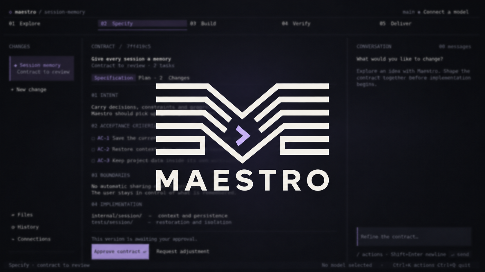
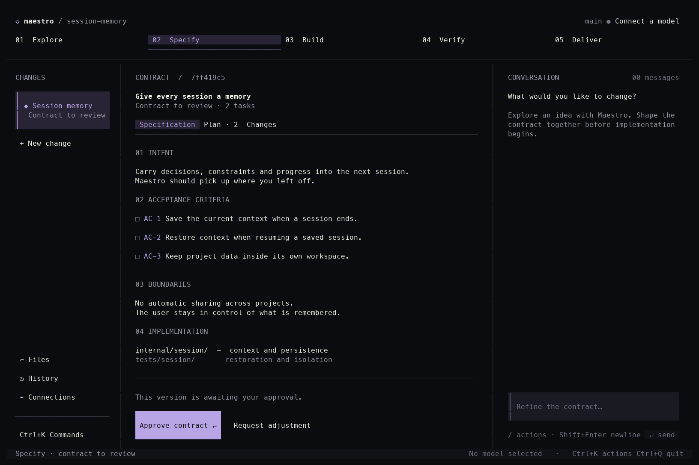
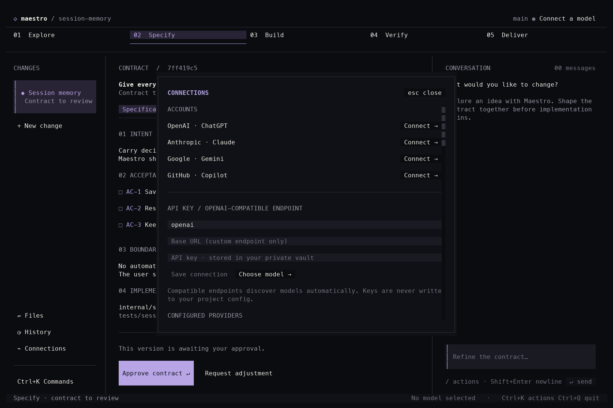
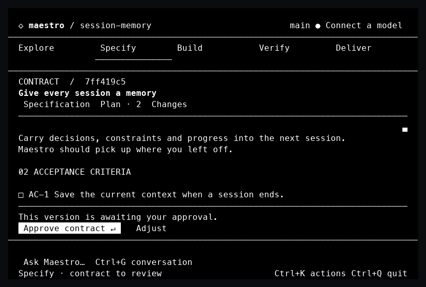

<p align="center">
  
</p>

<h1 align="center">Code in Concert.</h1>

<p align="center">
  <strong>A clear contract. A considered change.</strong><br>
  Spec-driven development, from the first idea to reviewed code, in your terminal.
</p>

<p align="center">
  <a href="#get-started">Get started</a> ·
  <a href="#the-workspace">The workspace</a> ·
  <a href="docs/MAESTRO_HARNESS.md">Harness guide</a> ·
  <a href="docs/TUI.md">Terminal guide</a> ·
  <a href="LICENSE">MIT license</a>
</p>

---

**Maestro brings the conversation, specification, execution plan and review into
one workspace.** Shape a change with your model, inspect its acceptance criteria,
approve the exact contract, and follow the implementation through verification
and documentation.

The built-in **Maestro harness** runs the work. Connect your account, bring an API
key, or use an OpenAI-compatible endpoint. Model choice stays independent of the
workflow.

## The workspace

An English terminal interface built with **OpenTUI, React, TypeScript and Bun**.
Ink backgrounds, ivory text and lavender accents keep the active contract in
focus. The Go host owns sessions, tools, credentials and workflow decisions.

<p align="center">
  <a href="docs/assets/tui-contract.png">
    
  </a>
</p>

<p align="center"><sub>Contract review in the compiled TUI, captured from an isolated example project.</sub></p>

- **Review before execution.** Read the specification and plan together.
  Approval is bound to the contract version you inspected.
- **Follow each contribution.** Tasks carry acceptance criteria, dependencies
  and file ownership. A completed worker still needs a contribution review.
- **Keep the evidence close.** Inspect source files, Git changes, recorded
  checks and delivery documents without losing the conversation.
- **Use the whole terminal.** Navigate with the keyboard or mouse, paste
  multiline prompts, follow clickable links, and work down to 80×24.
- **Pick up where you left off.** Restore saved sessions with their project
  and Git workspace identity.

<details>
<summary><strong>Connections: accounts, API keys and compatible endpoints</strong></summary>

<p align="center">
  <a href="docs/assets/tui-connections.png">
    
  </a>
</p>

Connect an account or enter a provider name, base URL and API key. Compatible
endpoints discover their models automatically; the open model selector updates
as discovery completes. Keys are masked and stored in the private credential
vault, rather than project configuration.

</details>

<details>
<summary><strong>A smaller terminal, the same contract</strong></summary>

<p align="center">
  <a href="docs/assets/tui-compact.png">
    
  </a>
</p>

At smaller sizes, **Ctrl+G** switches to the conversation and **Ctrl+K** keeps
changes and actions within reach. `NO_COLOR` selects a monochrome palette.

</details>

## Get started

This README describes the current source checkout. Build from source to use the
new harness and OpenTUI workspace; a previously published package may contain
an earlier interface. Packaged versions are listed on the
[releases page](https://github.com/BRYANN2K/maestro/releases).

**Build requirements:** Go 1.26.5+, Bun 1.3.14 and Python 3.11+ (`python3` on PATH).

```sh
git clone https://github.com/BRYANN2K/maestro.git
cd maestro
make build
./bin/maestro --dir /path/to/your/project
```

The build produces `maestro`, `maestro-ui`, `maestro-runtime` and the matching
`pi_natives.*.node` library in `bin/`. Keep the bundle together. Go and Bun are
build dependencies; Python is also required at runtime for Stipulate and RLM.
A standalone `go install` does not install the complete bundle.

**Your first change:**

1. Press **Ctrl+P** to connect an account, an API key or a compatible endpoint.
2. Press **Ctrl+L** and choose a model.
3. Open **Ctrl+K → New change**. Give it a title; Maestro creates the workflow
   files and initializes Stipulate if needed.
4. Discuss the goal and shape the proposal, specification and execution plan.
   Review the contract and its acceptance criteria before approving it.
5. Start the approved work. Review contributions, record verification evidence,
   update the documentation and archive the checked change.

The [harness guide](docs/MAESTRO_HARNESS.md) includes the complete command flow,
execution-plan format, provider setup and configuration examples.

## From intent to evidence

```text
Explore  →  Specify  →  Build  →  Verify  →  Deliver
  idea      contract    tasks    evidence    docs
```

| Workspace phase | What you review |
| --- | --- |
| **Explore** | The problem, proposal, scope and boundaries |
| **Specify** | Acceptance criteria, execution plan and version-bound approval |
| **Build** | Approved tasks, dependencies, owned paths and worker contributions |
| **Verify** | Fresh evidence against the acceptance criteria |
| **Deliver** | Documentation and the archive decision |

Opening a phase only changes the view. Approval, starting work and accepting a
contribution are explicit actions.

The underlying Stipulate lifecycle is
`bootstrap → explore → validate → apply → check → docs → archive`. Maestro adapts
the workflow engine and coordinator from
[Stipulate Skills](https://github.com/BRYANN2K/stipulate-skills), including its
29 domain extension bundles. Contracts and evidence live with the project.

## One harness. Your models.

Maestro runs its own built-in harness, with a forked **oh-my-pi** scheduler and
provider adapters, a **Prime Agent** Python kernel for RLM, and **Stipulate** for
contract-driven coordination.

| Connection | How it works |
| --- | --- |
| **Accounts** | Bundled adapters for OpenAI account access, Anthropic, Google Gemini and GitHub Copilot |
| **API keys** | Direct provider access with credentials in Maestro's private vault |
| **Compatible endpoints** | Custom base URL, optional key and automatic `/models` discovery |

No external coding-agent CLI is required. Provider names such as `openai-codex`
identify account transports; they do not select a different harness.

The coordinator can delegate approved, scoped tasks and collect their
contributions. Workers execute synchronously in the selected checkout;
parallel writers are not enabled. The RLM kernel supports successive Python
cells within a run and requires explicit code-execution permission.

See [provenance and execution boundaries](docs/MAESTRO_HARNESS.md#provenance-and-qualification)
for pinned upstream revisions, licenses and qualification details.

## Controls that stay out of the way

| Shortcut | Action |
| --- | --- |
| **Ctrl+K** | Commands and workflow actions |
| **Ctrl+P** | Connections |
| **Ctrl+L** | Model selection |
| **Ctrl+G** | Conversation on smaller terminals |
| **Tab / Shift+Tab** | Move focus |
| **Enter** | Activate an action or send a message |
| **Shift+Enter / Ctrl+J** | Newline |
| **Escape** | Close a dialog; cancel a pending input prompt |
| **Ctrl+C** | Cancel active work or clear the idle composer |
| **Ctrl+Q** | Exit |

Click an underlined HTTP/HTTPS link to open it in your browser. Use the mouse
wheel to scroll each panel. `/help`, `/providers`, `/model`, `/resume` and
`/workflow` are also available from the composer.

## Project context and integrations

- **Sessions and worktrees:** saved sessions retain their workspace identity;
  approvals are not transferred to a different branch.
- **MCP:** stdio, Streamable HTTP and SSE integrations with namespaced,
  approval-gated tools.
- **Agent Skills:** discover and explicitly select project or user `SKILL.md`
  instructions. Skill text cannot grant extra tool authority.
- **Configuration:** user and project `maestrorc` files configure providers,
  models, routes, budgets and integrations. Credentials belong in the vault.
- **Classic interface:** `maestro tui --classic` retains the earlier Bubble Tea
  interface and editor, using the same Maestro harness. The default Files view
  is a read-only source preview.

## Documentation

| Guide | Contents |
| --- | --- |
| [Terminal workspace](docs/TUI.md) | Layout, controls, links and connection flow |
| [Maestro harness](docs/MAESTRO_HARNESS.md) | Providers, Stipulate, RLM, commands and provenance |
| [Architecture](docs/ARCHITECTURE.md) | Components and ownership boundaries |
| [Agent Skills](docs/SKILLS.md) | Discovery, selection and tool limits |
| [Production readiness](docs/PRODUCTION_READINESS.md) | Release gates and known limits |
| [Changelog](CHANGELOG.md) | Project changes |

## Development

```sh
make build          # build the complete local bundle
make test           # Go tests with the race detector
make runtime-test   # compiled harness and workflow integration
make ui-test        # renderer, TypeScript, host and production PTY tests
make check          # Go, launcher, runtime and UI checks
make release-check  # release checks, vulnerabilities and npm package inspection
```

Local HTTP fixtures verify routing and streaming without claiming live account
or billing qualification. Native OAuth and foreign-platform execution require
separate testing. See the [terminal guide](docs/TUI.md) and
[readiness notes](docs/PRODUCTION_READINESS.md) for details.

---

<p align="center">
  Built by <a href="https://github.com/BRYANN2K">BRYANN2K</a> ·
  <a href="https://x.com/bryann2k_dev">Follow the project</a> ·
  <a href="https://github.com/BRYANN2K/maestro/issues">Report an issue</a><br>
  Open source under the <a href="LICENSE">MIT License</a>.
</p>
